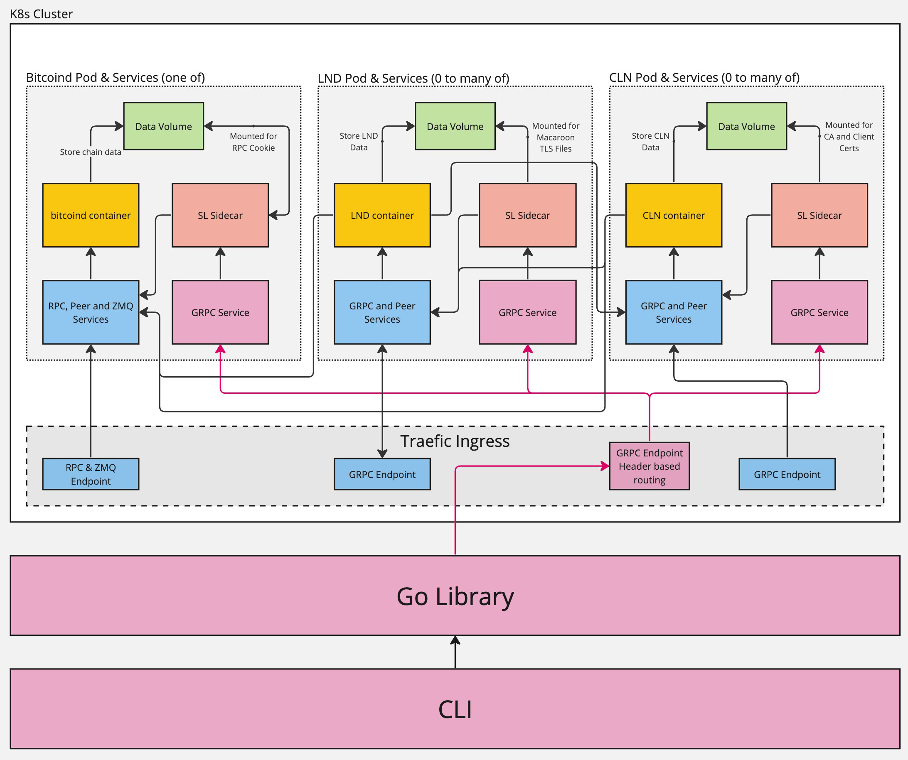

# Architectural overview

SL is Kubernetes based and takes advantage of the tooling surrounding the ecosystem. Notably, the definition for which nodes to run and their configuration options is done via helm. Helm charts currently exist for bitcoind, lnd and cln and can be found by version at [https://charts.scalinglightning.com/](https://charts.scalinglightning.com/). Helmfile can be configured to use the SL helm repository so there is no need to add it to your local helm installtion.

All components of scaling are versioned with the same tag. So if using version x of the API or CLI, it is recommended to use version x of the helm charts which in turn will reference version x of the sidecar client containers.

## High level components

On a local machine the scaling lightning CLI or Library connects to the kubernetes cluster via a [Traefik](https://traefik.io/traefik/) ingress. It's worth noting that the kubernetes "cluster" can be a local instance also. SL has been tested to run on Kubernetes provided by Docker Desktop and Minikube.

Inside the cluster, off-the-shelf containers for bitcoind and lightning implementations are used making it extremely easy to swap them out to test against a different version. To provide a common api between implementations and to make it easier to interact with the network, sidecar containers are run alongside the main implementaion containers inside the same pod.

If configured, direct communication with any of the nodes is made available via their GRPC interfaces (or RPC in bitcoind's case) and exposed via a traefik endpoint. Currently a maximum of 39 endpoints (endpoint1 - endpoint39) are available to be assigned to nodes.
